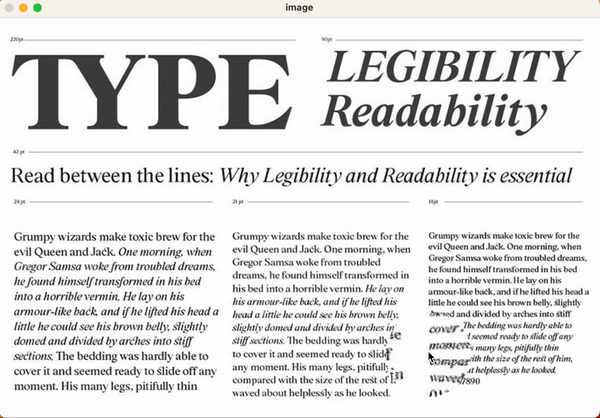
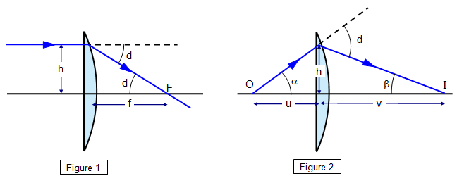

# MagnifyingGlass



# Overview

This is a personal project for me to understand how lenses work. This is my intent of simulating
lenses using the lens equations and trigonometry concepts.




# Getting Started

## Installing

To get started, first clone this repository:

```bash
git clone https://github.com/breakInIf/MagnifyingGlass.git
```

then you can install the needed dependencies by running

```bash
pip install -r requirements.txt
```

This project uses Cython, so you need to run the following line:

```bash
python setup.py build_ext --inplace
```

or you can use make if you want

```bash
make compile
```

## Running

To run the project just execute

```bash
python3 main.py -i <path_to_img>
```

you can pass the precision parameter as well using -p

```bash
python3 main.py -i <path_to_img> -p 100
```

> **Warning** Too high precision may affect performance.

You can run some pre-made tests as well

```bash
make test1
```

```bash
make test2
```

```bash
make test3
```

